---
# try also 'default' to start simple
theme: default
# random image from a curated Unsplash collection by Anthony
# like them? see https://unsplash.com/collections/94734566/slidev
background: https://cover.sli.dev
# some information about your slides (markdown enabled)
title: Title
info: |
  ## Slidev Starter Template
  Presentation slides for developers.

  Learn more at [Sli.dev](https://sli.dev)
# apply UnoCSS classes to the current slide
class: text-center
# https://sli.dev/features/drawing
drawings:
  persist: false
# slide transition: https://sli.dev/guide/animations.html#slide-transitions
transition: slide-left
# enable MDC Syntax: https://sli.dev/features/mdc
mdc: true
# duration of the presentation
duration: 35min
lineNumbers: true
---

# Journée des métiers

Présentation de parcours RIM - Pierre Cochard

Université Jean Monnet, 13 Février 2026

<div @click="$slidev.nav.next" class="mt-12 py-1" hover:bg="white op-10">
  <carbon:arrow-right />
</div>

<div class="abs-br m-6 text-xl">
  <button @click="$slidev.nav.openInEditor()" title="Open in Editor" class="slidev-icon-btn">
    <carbon:edit />
  </button>
  <a href="https://github.com/slidevjs/slidev" target="_blank" class="slidev-icon-btn">
    <carbon:logo-github />
  </a>
</div>

<!--
The last comment block of each slide will be treated as slide notes. It will be visible and editable in Presenter Mode along with the slide. [Read more in the docs](https://sli.dev/guide/syntax.html#notes)
-->

---
transition: fade-out
---

# Sommaire

<!-- <style> ul li {font-size: 30px} </style> -->

<!--
You can have `style` tag in markdown to override the style for the current page.
Learn more: https://sli.dev/features/slide-scope-style
-->

<Toc text-sm minDepth="1" maxDepth="1" />


<style>
h1 {
  background-color: #2B90B6;
  background-image: linear-gradient(45deg, #4EC5D4 10%, #146b8c 20%);
  background-size: 100%;
  -webkit-background-clip: text;
  -moz-background-clip: text;
  -webkit-text-fill-color: transparent;
  -moz-text-fill-color: transparent;
}
</style>

<!--
Here is another comment.
-->

---
transition: fade-out
---

# **Parcours personnel initial**

<br>

<v-clicks>

- **Licence Médiation Culturelle & Communication**
  - *ICT Toulouse, 2010*
- **Master Expertise des Professions et Institutions de la Culture**
  - Université de Nantes, 2011-2012

</v-clicks>

<br>

<v-clicks>

- ***Autodidacte***, pas de formation musicale académique (Conservatoire, Université)
- Pratique instrumentale amateur (guitare, claviers)
- Pratique **MAO** (**Cubase**), **Max/MSP** (v5), **NI Reaktor**, ...
- Composition musique électronique/électroacoustique, 
- Animation émission de radio (Nantes, JetFM)

</v-clicks>

<style> ul li {font-size: 22px} </style>

---
transition: fade-out
---

# **Master RIM (2013-2014)**

<br>

- Entrée sur dossier, entretien (L. Pottier, Y. Orlarey)
- Etudiants avec **parcours très variés**
- Programme **très complet** (et très dense) : 
  - **Techniques/ingénierie du son**
  - **Langages de programmation** (Faust, Max, Csound, C, Lisp, ...)
  - **Composition, formation musicale**
  - **Ethnomusicologie, histoire de la musique** 
  - *etc.*
- **Projets personnels**
- **Stages**

<!-- Ajouter autres slides avec screenshots de projets faits pendant le master -->

<style> ul li {font-size: 21px} </style>

---
transition: fade-out
---

## **Projet *La marche des anges***

<!-- <div class="absolute left--10 top-35px">

</div> -->

<SlidevVideo autoplay controls>
  <!-- Anything that can go in an HTML video element. -->
  <source src="./media/master-rim/la-marche-des-anges.mp4" type="video/mp4" />
</SlidevVideo>


---
transition: fade-out
layout: two-cols-header
---

## **Projet de fin d'année**

::left::

<div class="absolute left--280px top--80px">

</div>

::right::

<div class="absolute right--260px top--50px">
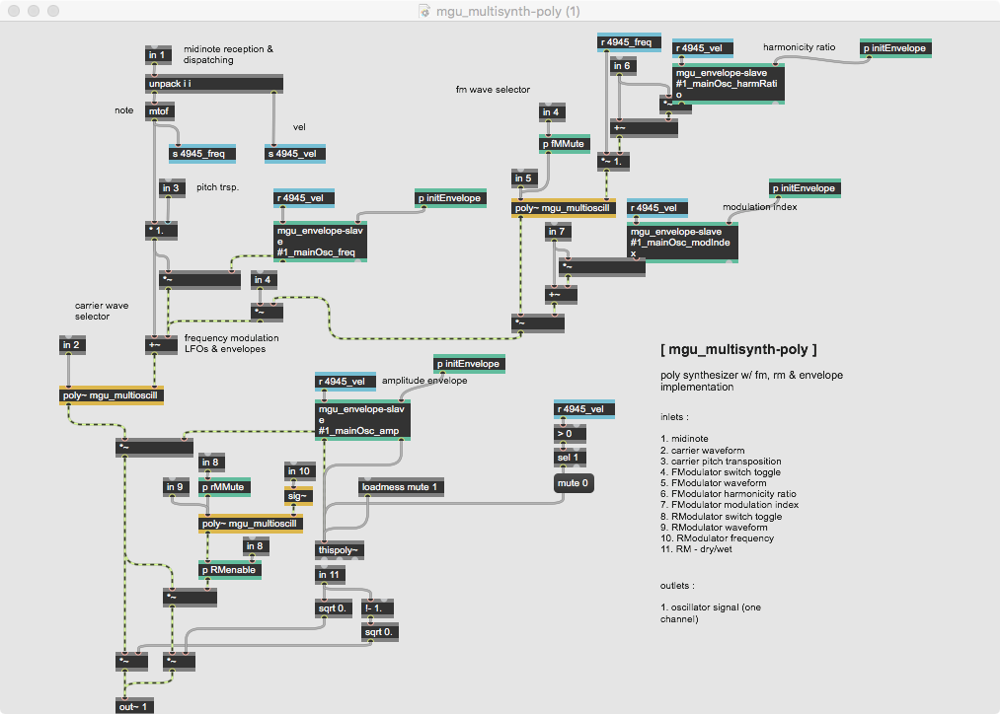
</div>

<style>
.two-cols-header {
  column-gap:20px; /* Adjust the gap size as needed */
}
</style>

<!-- </div> -->

---
transition: fade-out
# layout: image
# image: media/master-rim/selvanScapes-chronologie-projet.jpg
# backgroundSize: 85%
---

<div class="absolute left--5 top-15px">
  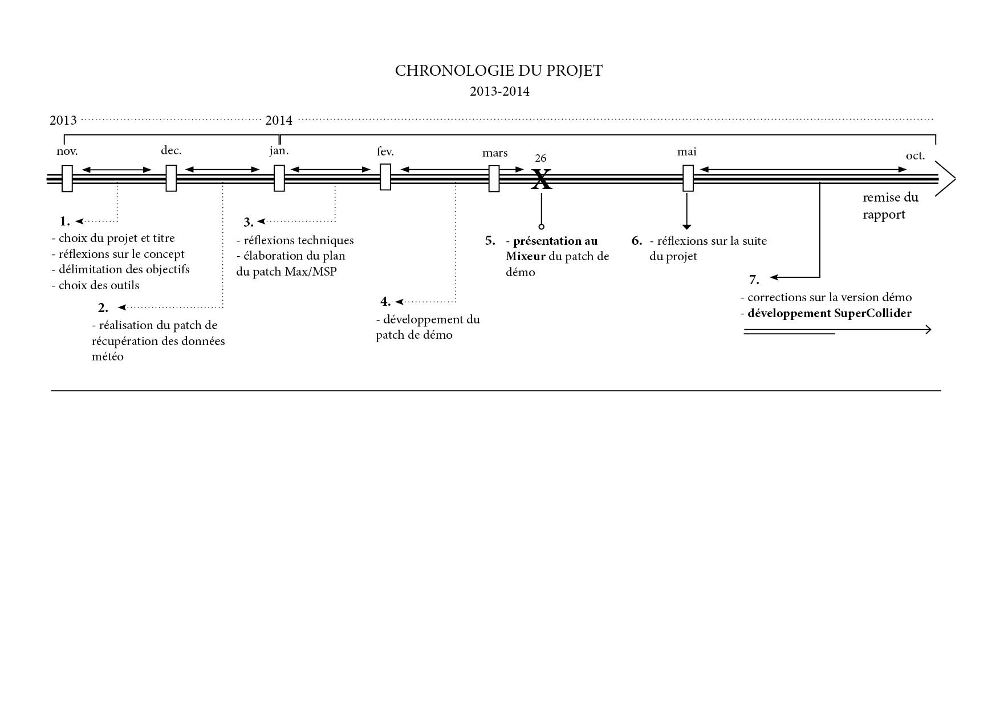
</div>

---
transition: fade-out
layout: image-right
image: media/master-rim/birds.png
backgroundSize: 75%
---

## **Projet Faust : *birds***

<br>

```js
/*:
- Bird singing generator.
- Head = Reverberation, birds heard from far away.
- Bottom = Maximum proximity of the birds.
- Right = maximum speed of whistles.
- Left = minimum speed, birds rarely heard.
*/

process = hgroup("Birds", 
    mainOsc(
        noteTrig 
      : rdm(72,94) 
      : mtof, noteTrig) 
      * envWrapper(noteTrig, ampEnv, amp_xp(2510)) 
      : fi.lowpass(1, 2000) *(0.8) 
      <: _,_, (rdmPanner : panSte) 
      : panConnect 
      : *,* 
      : reverb
);

// ...
```


---
transition: fade-out
---

## **Stages**

<br>

<v-clicks>

## **Décembre-Janvier 2014 - APO33 (Nantes)**

 <br>

> -  Réalisation d'une interface **Qt5** (*C++*) pour logiciel de streaming open-source (*IceStream*)

</v-clicks>

<br>

<v-clicks>

## **Mai-Août 2014 - SCRIME-LaBRI (Bordeaux)**

<br>

> - **Assistant RIM** (J. Larralde)
> - **Embauche dès la fin du stage** \o/

</v-clicks>

<style> ul li {font-size: 22px} </style>

---
transition: fade-out
---

# **Réalisateur en informatique musicale**, <br> **SCRIME-LaBRI (Bordeaux, 2014-2017)**


<div class="absolute left--90 top-385px">
  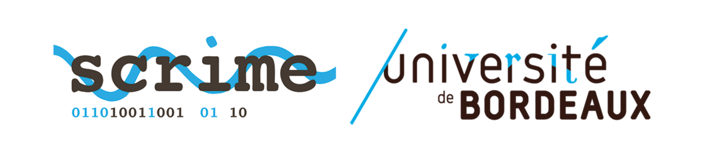
</div>

<br>

- **Studio de Creation et de Recherche en Informatique et Musiques Expérimentales**
- Equipe de recherche, liée au **Laboratoire Bordelais de Recherche en Informatique** (LaBRI), et à **l'Université de Bordeaux**
- Dirigé par **Myriam Desainte-Catherine** (maintenant **Louis Bigo**)
- Campus Universitaire de **Talence**
- Axes de recherches : **partitions interactives**, **spatialisation sonore**, *etc.*
- **Résidences de création**, **concerts**, **évènements**, **enseignement**...

<style> ul li {font-size: 22px} </style>

---
transition: fade-out
---

> ## **Opérateur studio, maintenance des équipements**

<br>

<v-clicks>

- **Studio octophonique** (8x Genelec 1030 + 2x Genelec 1037)
- Devenu ***Dôme 3D*** en 2017 (18x Genelec 8030 6'5)
- Salle de conférence, studio concert ***Hémicyclia***
  - **Acousmonium** modulaire (24x HP)
- Pilotage **Pro Tools** (avec contrôleur dédié)
- Gestion et maintenance du parc informatique (*macOS*)

</v-clicks>

<style> ul li {font-size: 22px} </style>

<!--  Ajouter screenshots studios -->

---
transition: fade-out
---

## **Studio Elise**

<br>

<div class="absolute left--5 top-25px">
  
</div>


<style> ul li {font-size: 22px} </style>

---
transition: fade-out
---

## **Salle *Hémicyclia***

<br>

<div class="absolute left--5 top-25px">
  
</div>


<style> ul li {font-size: 22px} </style>

---
transition: fade-out
---

## **Salle *Hémicyclia***

<br>

<div class="absolute left--5 top--35px">
  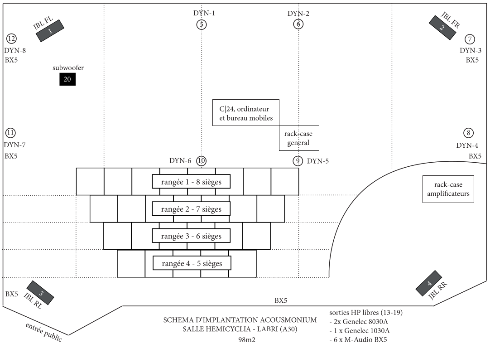
</div>


<style> ul li {font-size: 22px} </style>


---
transition: fade-out
---

## **Dôme 3D**

<br>

<div class="absolute left--5 top-25px">
  
</div>


<style> ul li {font-size: 22px} </style>

---
transition: fade-out
---

<br>

> ## **Opérateur studio, maintenance des équipements**

<br>

- Former les utilisateurs au **fonctionnement opérationnel** des différents studios
  - **Câblage**, **sécurité**...
  - **Prêt de matériel** pour prises de son ou évènements
  - **Bancs de montage audionumériques** (Pro Tools, Reaper, Ableton Live)
    - **Plugins de spatialisation**

<br>

- **Adapter les moyens techniques aux besoins des compositeurs**
  - Disposition des haut-parleurs (Acousmonium *Hémicyclia*)
  - Algorithmes de spatialisation

<!-- Schéma du patch Neutrik par ex.  -->

<style> ul li {font-size: 22px} </style>

---
transition: fade-out
---

## <u> **Routing, patch-bays studio** </u>

<br>

<div class="absolute left--200px top-100px">
  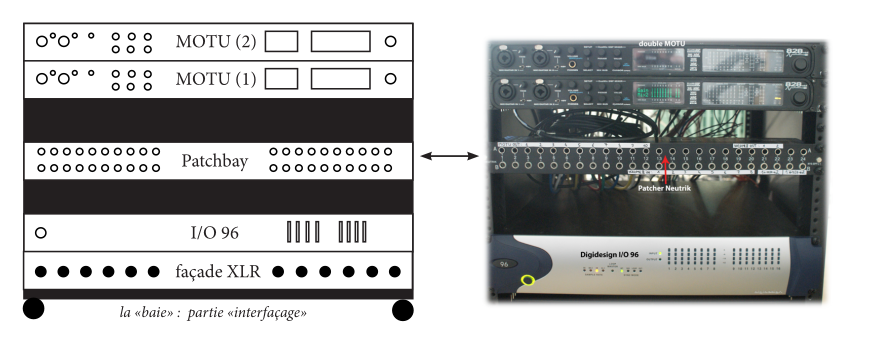
</div>

<div class="absolute left-350px top--10px">
  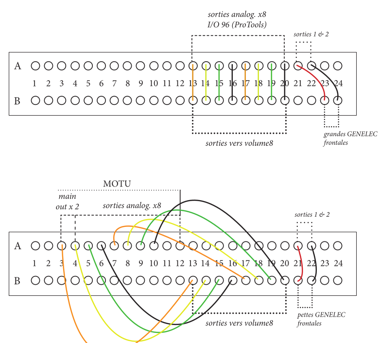
</div>


<style> ul li {font-size: 22px} </style>

---
transition: fade-out
---

> ## **Technicien/ingénieur son pour concerts et évènements**
<br>

<v-clicks>

- **Concerts-lecture** avec compositeur invité (Forum de Talence) ~ *1x/mois*
  - **Concerts spatialisés** (*octophonie++*)
  - *projetés* en direct par les compositeurs eux-mêmes
- **Concerts thématiques**
  - *Piano Day*, *Hommage à Xenakis*, *Autechre*, *Raster-Noton*, *etc.*
- **Sorties de résidence**
- **Installations sonores**
- **Conférences** scientifiques/musique ou mixtes, workshops
  - Colloque *Chowning-Risset*

</v-clicks>

<style> ul li {font-size: 22px} </style>

---
transition: fade-out
---

## **Concert *tribute* - Raster-Noton** (Talence, 2016)

<br>

<div class="absolute left--5 top-25px">
  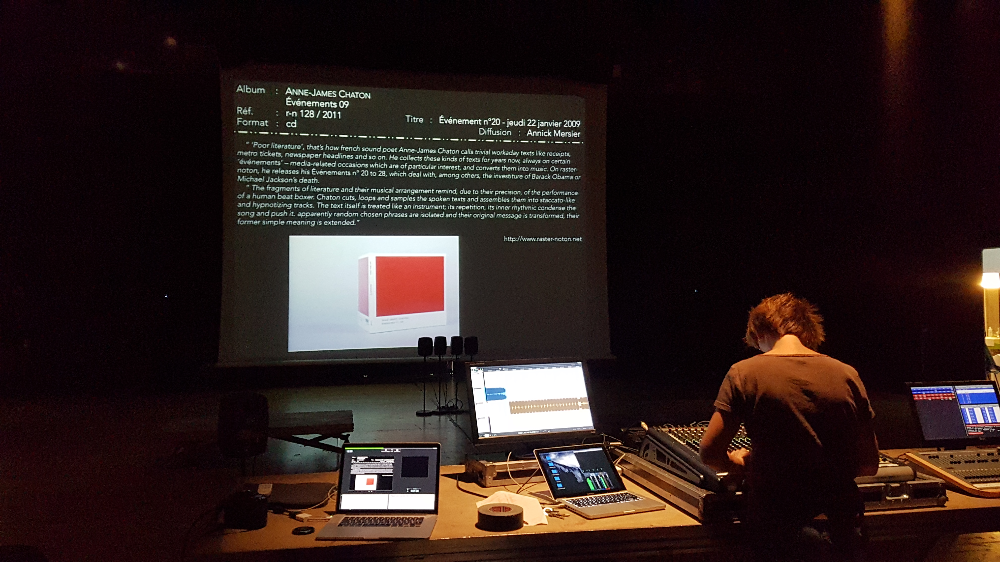
</div>


<style> ul li {font-size: 22px} </style>

---
transition: fade-out
---

## **Concert - Christian Eloy** (Halle des Chartrons - Bordeaux, 2017)

<br>

<div class="absolute left--5 top-25px">
  
</div>


<style> ul li {font-size: 22px} </style>

---
transition: fade-out
---

<br><br><br><br><br>

## **Colloque Chowning-Risset**
## (ENSEIRB-MATMECA, 2014)

<br>

<div class="absolute left-100 top--130px">
  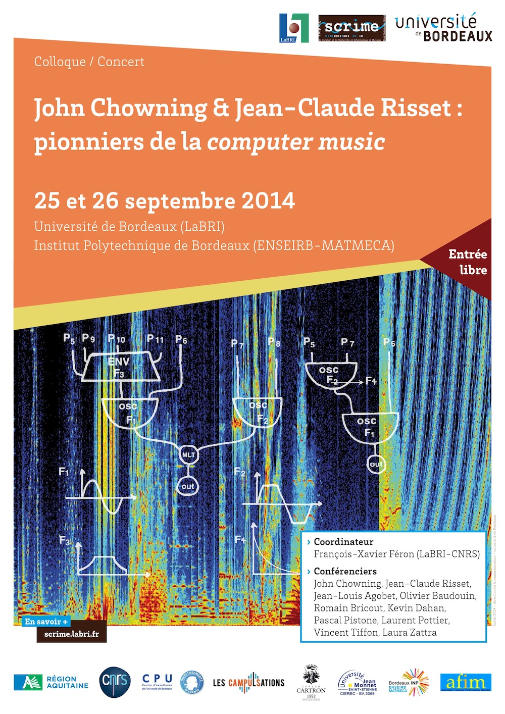
</div>


<style> ul li {font-size: 22px} </style>

---
transition: fade-out
layout: two-cols-header
---

> ## **Développement, *beta-testing* du logiciel *i-score* (ANR OSSIA)**

<br>

::left:: 

<br>

<Youtube id="8-KpNaF2K8Q?si=P4GUSANO9xTrZWfo" width=400px height=400px />

::right::

<br>

- **Réalisation de démos**
- **Debugging**, ***bug reporting***
- **Documentation**, **promotion**
- **Intégration** avec autres environnments 
  - **Faust**
  - **SuperCollider**
  - **Max**
  - **Pure Data**, etc.
- **Développement d'add-ons**

<!-- Ajouter présentation d'i-score avec screenshots, voire carrément vidéo -->
<!-- Block de code OSSIA-SuperCollider -->

<style> ul li {font-size: 22px} </style>

---
transition: fade-out
---

## **Intégration avec SuperCollider** (*OSCQuery*)

<br>

```js
(
d = OSSIA.device("ossia-collider").exposeOSCQueryServer(1234, 5678, {
    ~freq = OSSIA.parameter(d, 'frequency', Float, [0, 20000], 440);
     ~mul = OSSIA.parameter(d, 'mul', Float, [0, 1], 0.125);
     ~pan = OSSIA.parameter(d, 'pan', Float, [-1, 1], 0);
});
)

SynthDef('sinosc', {
	Out.ar(0, Pan2.ar(SinOsc.ar(~freq.kr, 0, ~mul.kr), ~pan.kr));
}).add;

// create synth with parameters' current values
x = Synth('sinosc', d.snapshot);

// now every change in the parameters' values will be reported on the sc-server
~freq.value = 220;
~pan.value = 1;
~mul.value = 0.125;
```

<style> ul li {font-size: 22px} </style>

---
transition: fade-out
---

> ## **Accompagnement d'artistes en résidence de création**

<br>

- Expérimentations autour du logiciel ***i-score*** et **spatialisation sonore** :
  - **G. Gagneré** - *ParOral*
  - **A. Bonardi** - *Pianotronics III*
  - **D. Garnier** - *L'arbre intégral*
  - **P. Cochard** - *quarrè (v1.0)*
- **Accompagnement technique** studio, acousmonium, programmation, création, sound-design, etc.
- Accompagnement pour **sorties de résidence extérieures** (tournée **Arbre intégral**)
- **Feedback** (*live-debugging*) et support sur le logiciel *i-score*

<!-- Pas toujours évident avec des logiciels en développement, sachant que le spectacle vivant est un contexte plutôt critique -->

<!-- Ajouter media pour illustrer les différents projets -->

<style> ul li {font-size: 22px} </style>

---
transition: fade-out
---

## **Georges Gagneré - *ParOral*** (Hémicyclia, 2015-2017)

<SlidevVideo autoplay controls scale="75%">
  <!-- Anything that can go in an HTML video element. -->
  <source src="./media/ParOralPresentation.mp4" type="video/mp4"/>
  
</SlidevVideo>


<style> ul li {font-size: 22px} </style>

---
transition: fade-out
---

## **Résidence de creation - *L'Arbre intégral*** (Ambarès, 2017)

<br>

<div class="absolute left--5 top-15px">
  
</div>

<style> ul li {font-size: 22px} </style>

---
transition: fade-out
---

## **Résidence de creation - *L'Arbre intégral*** (Ambarès, 2017)

<SlidevVideo autoplay controls scale="75%">
  <!-- Anything that can go in an HTML video element. -->
  <source src="./media/arbre-integral/ai_ambares.mp4" type="video/mp4"/>
  
</SlidevVideo>

<style> ul li {font-size: 22px} </style>

---
transition: fade-out
---

## **Résidence de creation - *L'Arbre intégral*** (Ambarès, 2017)

<br>

<div class="absolute left--5 top-15px">
  
</div>

<style> ul li {font-size: 22px} </style>

---
transition: fade-out
---

## **Résidence de creation - *L'Arbre intégral*** (Ambarès, 2017)

<div class="absolute left--5 top--15px">
  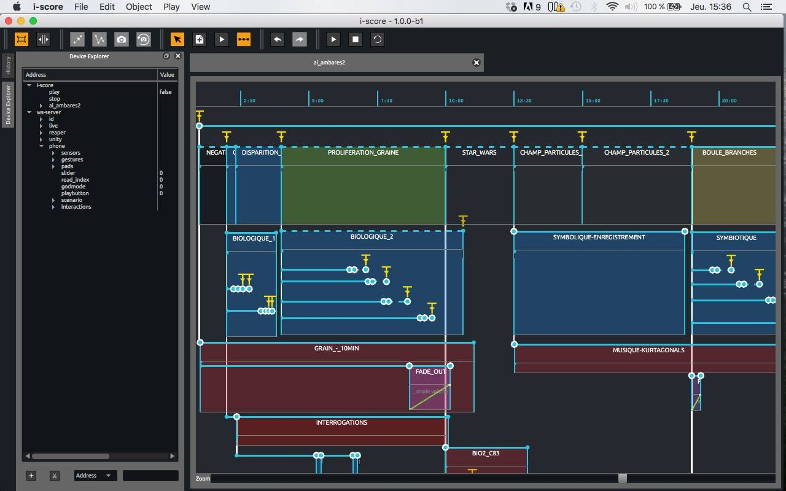
</div>

<style> ul li {font-size: 22px} </style>

---
transition: fade-out
---

## **Résidence de creation - *L'Arbre intégral*** (Ambarès, 2017)

<div class="absolute left--5 top--0px">
  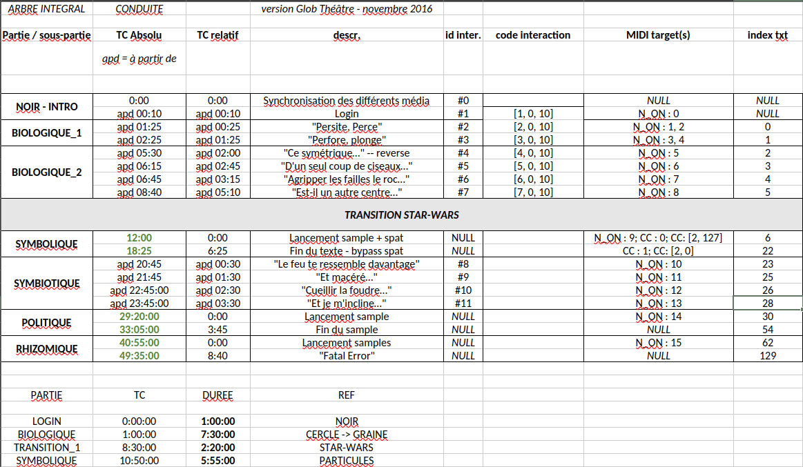
</div>

<style> ul li {font-size: 22px} </style>

---
transition: fade-out
---

## **Résidence de creation - Pascale Criton, Hugues Genevois**

<br>

<div class="absolute left--5 top-15px">
  
</div>


<style> ul li {font-size: 22px} </style>

---
transition: fade-out
---

## **Résidence de creation - *quarrè*** (Talence, 2016-2017)

<div class="absolute left--5 top-55px">
  
</div>

<style> ul li {font-size: 22px} </style>

---
transition: fade-out
---

> ## **Activités universitaires, académiques (recherche, formation)**

<br>

- **Ateliers pour scolaires** (**Semaine du Son**)
- Intervention des **compositeurs dans les écoles/collèges/lycées**
- Ateliers avec les **étudiants de l'Université** (Ableton Live)
- Workshops avec les **élèves du Conservatoire** (électroacoustique)
- Encadrement régulier de **stagiaires**

<br>

- **Activités de recherche, écriture d'articles scientifiques**

<style> ul li {font-size: 22px} </style>

---
transition: fade-out
---

> #### *Confronter les musiciens à leurs performances : description d'un dispositif méthodologique pour étudier l'interprétation acousmatique* - Féron, F-X., Boutard, G., Cochard, P.

<div class="absolute left--5 top-55px">
  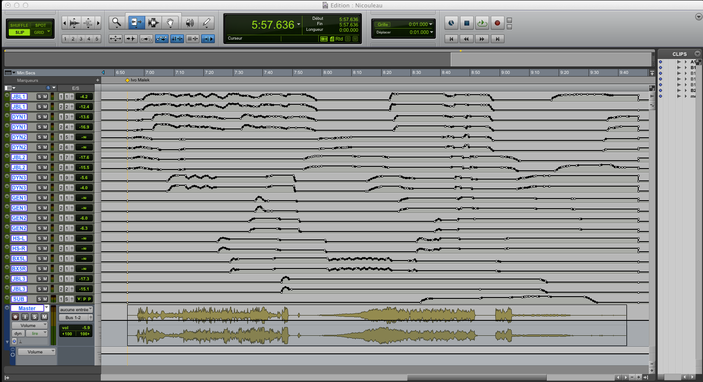
</div>

<style> ul li {font-size: 22px} </style>

---
transition: fade-out
---

# **Ingénieur projet Arts et Sciences,** 
# **IdEx Bordeaux (2015-2016)**

<br> 

- Faire le **lien entre Arts et Sciences**
- Collaboration entre **artistes et scientifiques** de l'Université de Bordeaux.
  - **Physique des matériaux** (nano-matériaux)
  - **Optique** (laser)
  - **Biologie** (sonification mouvement de micro-organismes)
  - *etc.*
- **Gestion et suivi de projets**, accompagnement sur **aspects techniques**, etc.
- Création du **festival Arts & Sciences FACTS**

<div class="absolute right-37 top--50px">
  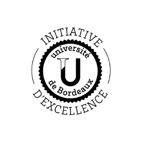
</div>

<div class="absolute right--55 top--320px">
  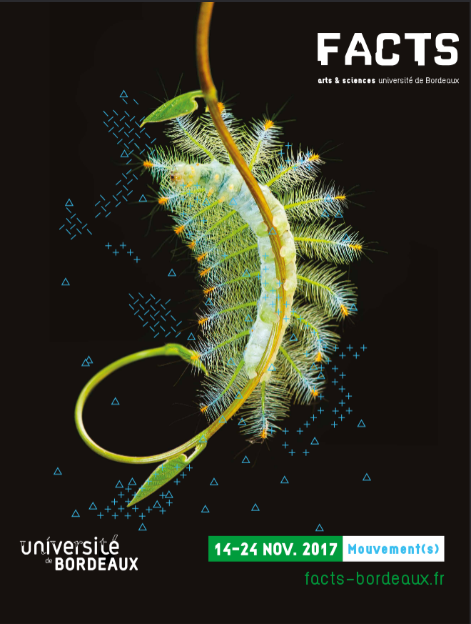
</div>

<style> ul li {font-size: 22px} </style>

---
transition: fade-out
---

# **Réalisateur en informatique musicale**
### **Freelance, Nantes, 2017-2020**

<br>

<div class="absolute right--165 top--385px">
  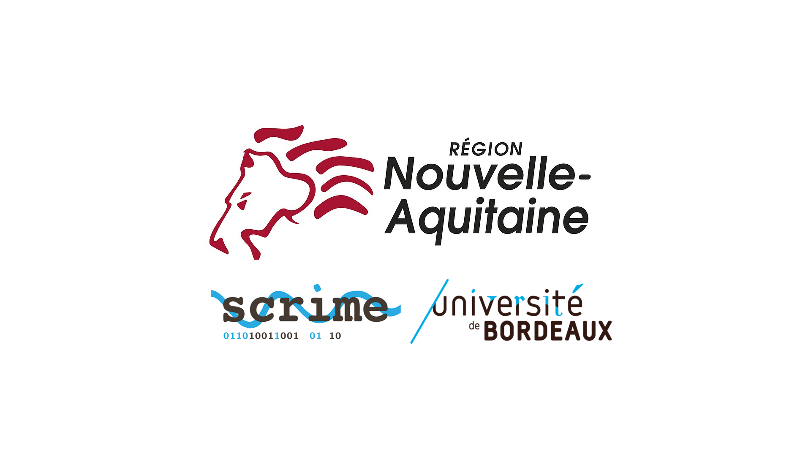
</div>

<v-clicks>

- projet ***quarrè***, installation sonore immersive et interactive
  - soutenu par le **SCRIME**, le **CRNA** (*La Fabrique - Cultures Connectées*)
  - scénario conçu avec **OSSIA score**
  - **~ 1 an d'écriture/programmation**
- **Restitutions multiples**
  - **Première Les Campulsations** (22-27 juin 2018) + <strike>version 3D 2019</strike> (annulée)
  - Médiathèque **Angoulême** (2018)
  - Festival Electroacoustique **Poitiers** (2018)
  - Journées d'informatiques musicales - **Bayonne** (2019)
  - Solutions Ouvertes pour la Sciences - **LAAS Toulouse** (2019)

</v-clicks>

<style> ul li {font-size: 20px} </style>

---
transition: fade-out
---

## **Vues serveur/client** de l'installation 

<div class="absolute left--5 top--5px">
  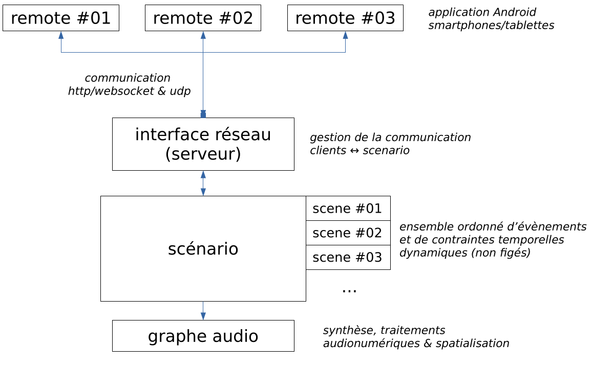
</div>

<style> ul li {font-size: 22px} </style>

---
transition: fade-out
---

## **Vues serveur/client** de l'installation 

<div class="absolute left--50 top--325px">
  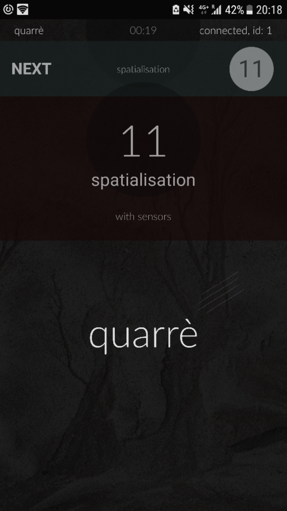
</div>

<div class="absolute left-55 top-95px">
  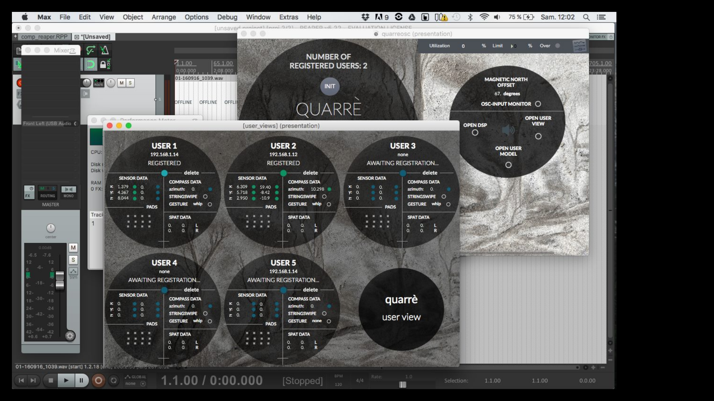
</div>

<style> ul li {font-size: 22px} </style>

---
transition: fade-out
---

## **Vues serveur/client** de l'installation 

<div class="absolute left--5 top-10px">
  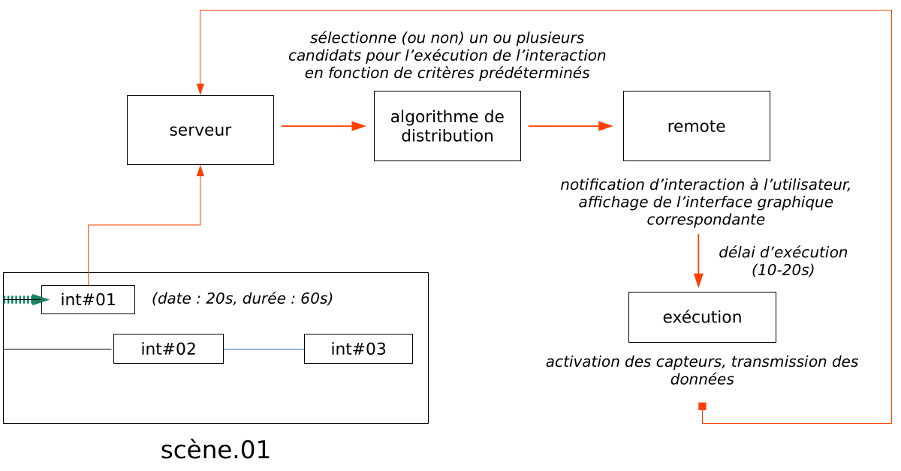
</div>

<style> ul li {font-size: 22px} </style>

---
transition: fade-out
---

## **Vue écriture scénario** (OSSIA score)

<div class="absolute left--85 top--80px">
  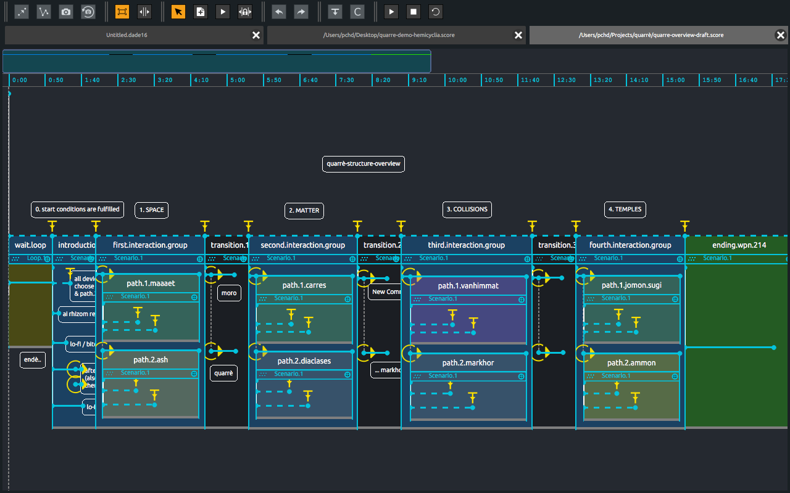
</div>

<div class="absolute right--110px top-50px">
  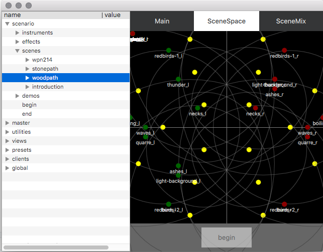
</div>

<style> ul li {font-size: 22px} </style>

---
transition: fade-out
---

## **Première - Les Campulsations** (Talence, 22-27 juin 2018)

<div class="absolute left--5 top-35px">
  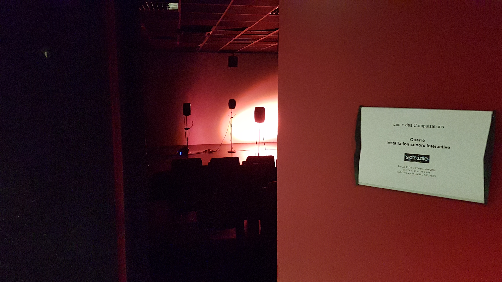
</div>

<style> ul li {font-size: 22px} </style>

---
transition: fade-out
---

## **Video**

<SlidevVideo timestamp="30" autoplay controls scale="75%">
  <!-- Anything that can go in an HTML video element. -->
  <source src="./media/quarre/montage.mp4" type="video/mp4"/>
  
</SlidevVideo>

<style> ul li {font-size: 22px} </style>


---
transition: fade-out
---

# **Développeur C++ (PULSALYS, GRAME, 2020-2021)**

<br>

- Développement d'un traducteur "**Max-to-Faust**" en C++
- Transfert de technologie **Université** - **SAT** - **Industrie** (**GRAME**-******)


<div class="absolute left--75 top--15px">
  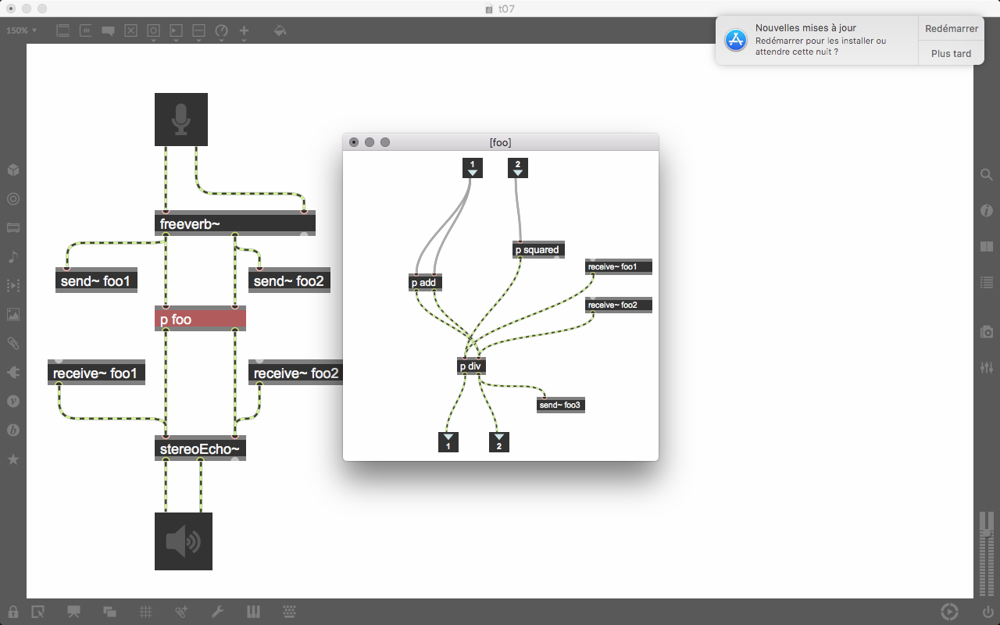
</div>

<div class="absolute left-275px top-75px">
  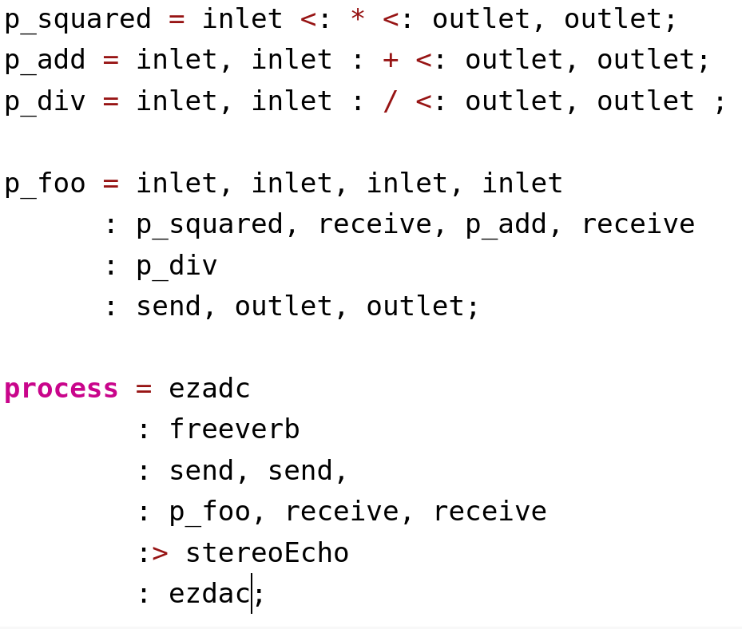
</div>


<style> ul li {font-size: 22px} </style>

---
transition: fade-out
---

# **Ingénieur de recherche, Equipe Emeraude, Inria, INSA-Lyon (Villeurbanne, depuis 2022)**

<br>

- Equipe dirigée par Tanguy Risset
- Collaboration étroite avec **GRAME-CNCM** (Y. Orlarey, S. Letz)
- **Langages**, **Compilation** (**Faust**)
- Développement **audio**, **systèmes embarqués** (**FPGA**)
  - Traitement du signal
  - Spatialisation (Ambisonie, Wave Field Synthesis)
  - Interfaces de contrôle
- Arithmétique avancée pour **opérateurs en virgule-flottante**/**virgule-fixe**

<style> ul li {font-size: 22px} </style>

---
transition: fade-out
---

## **Missions**

<br>

> ### 1. **Développement** et **maintenance** d'outils logiciels

- **SyFaLa**, toolchain **audio** sur **plateformes FPGA**
- **FloPoCo**, générateur d'opérateurs optimisés pour **FPGA**

<br>

> ### 2. **Recherche, écriture d'articles scientifiques**

<br>

> ### 3. **Enseignement, formation**
- Formation, encadrement **stagiaires** et **étudiants** sur les outils et thématiques développés par l'équipe
- Cours **Faust**, **Traitement du signal**, UJM - Masters **CCNT**(3) & **DIGICREA**(1)
- Cours **Rust**, INSA Télécom - 5ème année


<style> ul li {font-size: 22px} </style>

---
transition: fade-out
---

## **Field Programmable Gate Array** (**FPGA**)

<br>

+ Potientiel de parallélisation
+ Hardware reconfigurable
+ Très basse latence (*us*)

<style> ul li {font-size: 22px} </style>

---
transition: fade-out
---

## **SyFaLa**: audio embarqué sur plateformes FPGA

<br>

- Tanguy Risset, Romain Michon, Maxime Popoff
- https://github.com/inria-emeraude/syfala

<br>

- **Faust** (or **C++**) > **FPGA Xilinx** (via *High Level Synthesis*)
- **Linux embarqué** (Alpine)
  - Contrôle **MIDI**, **OSC**, **HTTP**, etc.
- Interface de **streaming audio ethernet** (**multicanal**)
- Haut **potentiel multicanal** (32+)
- Audio séparé de l'OS
- **Très basse latence** (min. 11 us @ 768 kHz)

<div class="absolute right--75 bottom--5">
  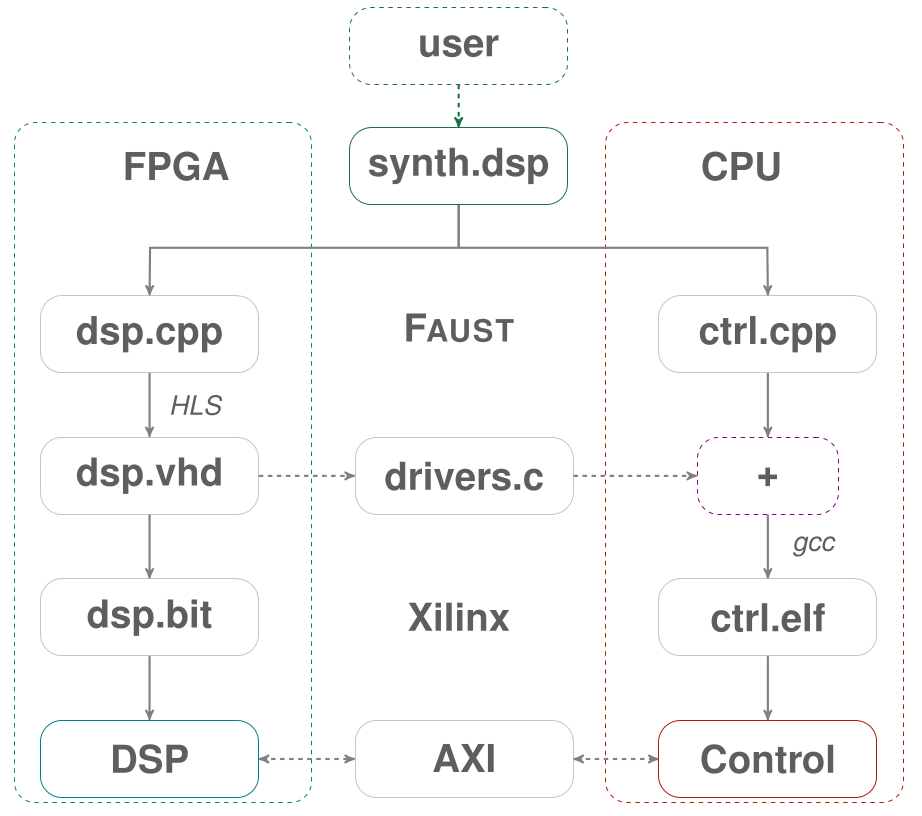
</div>

<div class="absolute right--50 bottom--75">
  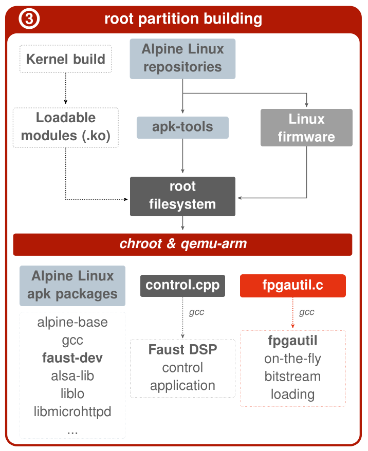
</div>

<style> ul li {font-size: 22px} </style>

---
transition: fade-out
---

## ***Barre d'espace*** - Inria Grenoble (WFS - 32 canaux)

<div class="absolute left--5 top-65px">
  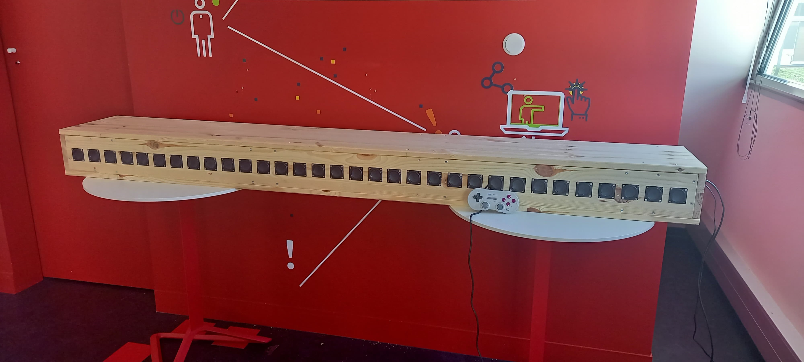
</div>

<style> ul li {font-size: 22px} </style>

---
transition: fade-out
---

## ***Barre d'espace*** - Inria Grenoble (WFS - 32 canaux)

<div class="absolute left--5 top-65px">
  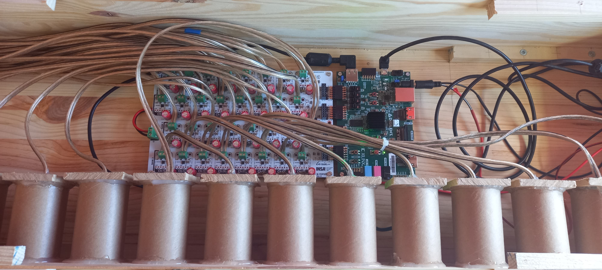
</div>

<style> ul li {font-size: 22px} </style>


---
transition: fade-out
---

## ***Zybo Multisynth*** 

<div class="absolute left--5 top-65px">
  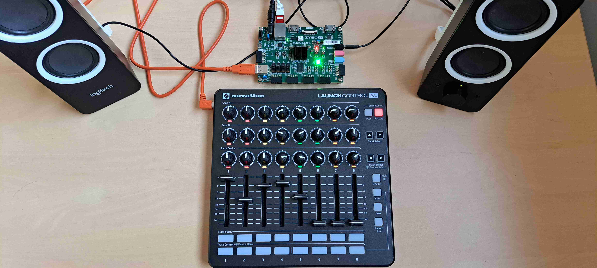
</div>

<style> ul li {font-size: 22px} </style>
