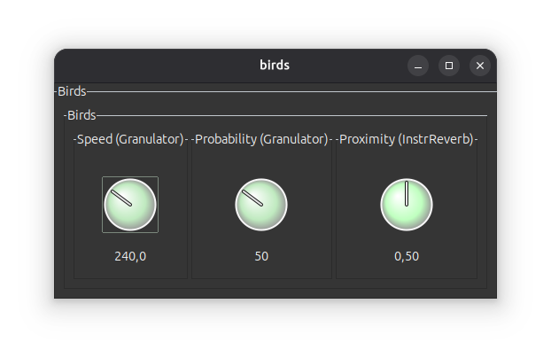
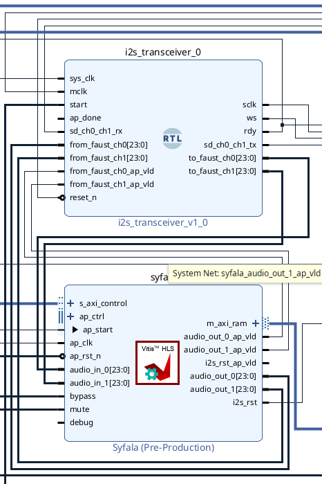
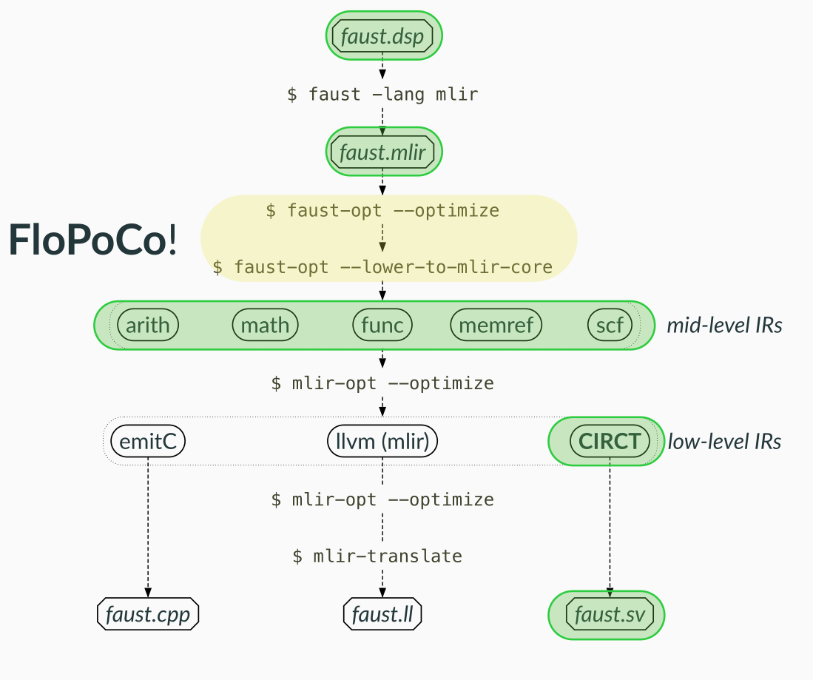

---
# try also 'default' to start simple
theme: default
# random image from a curated Unsplash collection by Anthony
# like them? see https://unsplash.com/collections/94734566/slidev
background: https://cover.sli.dev
# some information about your slides (markdown enabled)
title: Title
info: |
  ## Slidev Starter Template
  Presentation slides for developers.

  Learn more at [Sli.dev](https://sli.dev)
# apply UnoCSS classes to the current slide
class: text-center
# https://sli.dev/features/drawing
drawings:
  persist: false
# slide transition: https://sli.dev/guide/animations.html#slide-transitions
transition: slide-left
# enable MDC Syntax: https://sli.dev/features/mdc
mdc: true
# duration of the presentation
duration: 35min
lineNumbers: true
---

# Journée des métiers

Présentation de parcours RIM - Pierre Cochard

Université Jean Monnet, 13 Février 2026

<div @click="$slidev.nav.next" class="mt-12 py-1" hover:bg="white op-10">
  <carbon:arrow-right />
</div>

<div class="abs-br m-6 text-xl">
  <button @click="$slidev.nav.openInEditor()" title="Open in Editor" class="slidev-icon-btn">
    <carbon:edit />
  </button>
  <a href="https://github.com/slidevjs/slidev" target="_blank" class="slidev-icon-btn">
    <carbon:logo-github />
  </a>
</div>

<!--
Bonjour à tous et à toutes, je m'appelle Pierre Cochard, je suis Ingénieur de recherche au laboratoire CITI sur le campus de la Doua à Villeurbanne, et j'appartiens à l'équipe Emeraude, qui est une équipe avec deux co-tutelles, l'Inria et l'INSA-Lyon, et qui collabore de manière très étroite avec GRAME, qui est un centre national de création musicale qui est sité également à Villeurbanne.

Je suis aussi, et c'est pour ça que je suis là aujourd'hui, un ancien étudiant du Master RIM (Réalisateur en Informatique musicale) de l'UJM, par lequel je suis passé il y a une douzaine d'années, en 2013-2014.
-->

---
transition: fade-out
---

# Sommaire

<!-- <style> ul li {font-size: 30px} </style> -->

<!--
You can have `style` tag in markdown to override the style for the current page.
Learn more: https://sli.dev/features/slide-scope-style
-->

<Toc text-sm minDepth="1" maxDepth="1" />


<style>
h1 {
  background-color: #2B90B6;
  background-image: linear-gradient(45deg, #4EC5D4 10%, #146b8c 20%);
  background-size: 100%;
  -webkit-background-clip: text;
  -moz-background-clip: text;
  -webkit-text-fill-color: transparent;
  -moz-text-fill-color: transparent;
}
</style>

<!--
On m'a invité pour que je vous parle un petit peu de mon parcours et mon expérience de Réalisateur en informatique musicale (RIM), en espérant pouvoir peut-être vous intéresser un petit peu, voire carrément vous motiver à rejoindre la formation.

Vous allez voir que j'ai eu un parcours depuis 10-15 ans qui est relativement chaotique, mais c'est peut-être aussi une bonne chose en l'occurence puisque j'ai touché à beaucoup de choses différente, donc je vais pouvoir vous montrer pas mal d'aspects différents du métier de RIM et d'ingénieur en informatique-son-musique.
-->

---
transition: fade-out
---

# **Parcours personnel initial**

<br>

<v-clicks>

- **Licence Médiation Culturelle & Communication**
  - *ICT Toulouse, 2010*
- **Master Expertise des Professions et Institutions de la Culture**
  - Université de Nantes, 2011-2012

</v-clicks>

<br>

<v-clicks>

- ***Autodidacte***, pas de formation musicale académique (Conservatoire, Université)
- Pratique instrumentale amateur (guitare, claviers)
- Pratique **MAO** (**Cubase**), **Max/MSP** (v5), **NI Reaktor**, ...
- Composition musique électronique/électroacoustique, 
- Animation émission de radio (Nantes, JetFM)

</v-clicks>

<style> ul li {font-size: 22px} </style>

<!-- 
Pour vous présenter un petit peu mon parcours pre-Master, vous voyez que je n'était pas vraiment voué, ou destiné, à intégrer le Master, ou évoluer dans le domaine de l'informatique musicale, puisque j'ai fait une Licence de Médiation Culturelle et Communication à Toulouse, de 2007 à 2010. J'étais donc intéressé par les milieux artistiques et les milieux de la culture (avec toujours un focus sur la musique), mais je n'avais pas vraiment de background de formation artistique ou technique. 

J'ai suivi ensuite ce parcours en Master à l'UFR de Sociologie de Nantes, qui était intitulé "Master Expertise des Professions et Institutions de la Culture", donc toujours dans les métiers de la culture.

Parallèlement, j'avais une pratique assez soutenue, bien qu'autodidacte et amateur de la musique, je faisais de la guitare, des claviers, je jouais dans quelques groupes, et je m'intéressais de plus en plus à la MAO (Musique Assistée par Ordinateur), et particulièrement les logiciels comme Max/MSP ou Reaktor avec lesquels on pouvait faire de la musique en faisant de la programmation "graphique".

 -->

---
transition: fade-out
---

# **Master RIM (2013-2014)**

<br>

- Entrée sur dossier, entretien (L. Pottier, Y. Orlarey)
- Etudiants avec **parcours très variés**
- Programme **très complet** (et très dense) : 
  - **Techniques/ingénierie du son**
  - **Langages de programmation** (Faust, Max, Csound, C, Lisp, ...)
  - **Composition, formation musicale**
  - **Ethnomusicologie, histoire de la musique** 
  - *etc.*
- **Projets personnels**
- **Stages**

<style> ul li {font-size: 21px} </style>

<!-- 

Je suis tombé un peu par hasard sur une description du Master RIM à la fin de mon Master à Nantes, et ça correspondait vraiment à quelque chose que je voulais faire à l'époque, le programme me plaisait beaucoup, même si certain cours étaient assez effrayants. J'ai passé une validation d'acquis (je crois), et j'ai candidaté en envoyant mon dossier à Laurent Pottier, et en faisant un entretien avec lui, et Yann Orlarey.

Heureusement pour moi (un peu moins pour le Master), il y avait très peu de candidats cette année, et on s'est retrouvé à 5 dans la promotion, ce qui était très bien dans un sens, car on pouvait avoir des contacts un peu plus individuels avec les professeurs et les intervenants.

- Programe très complet
- Beaucoup de projets personnels, à faire à la maison
- Un aspect très pratique
- Dimension professionalisante avec les stages

 -->

---
transition: fade-out
---

## **Projet *La marche des anges***

<!-- <div class="absolute left--10 top-35px">

</div> -->

<SlidevVideo autoplay controls>
  <!-- Anything that can go in an HTML video element. -->
  <source src="https://wpn214.com/media/la-marche-des-anges.mp4" type="video/mp4" />
</SlidevVideo>

<!-- 
Un exemple de projet, que j'ai réussi à retrouver sur ma vieille machine de 2012, qui marche toujours! 
Un projet d'ethnomusicologie, dans lequel on devait illustrer le jeu alterné soufflé/aspiré à l'harmonica sur un morceau spécifique de musique populaire, en l'occurence ici "La marche des anges", joué par Noël Marcoux.
 -->


---
transition: fade-out
layout: two-cols-header
---

## **Projet de fin d'année**

::left::

<div class="absolute left--280px top--80px">

</div>

::right::

<div class="absolute right--260px top--50px">

</div>

<style>
.two-cols-header {
  column-gap:20px; /* Adjust the gap size as needed */
}
</style>

<!-- 
Un autre exemple, cette fois que je n'ai pas réussi à faire marcher.
On avait un projet de fin d'année à réaliser, je pense qu'on avait plus ou moins carte blanche sur celui-ci, et j'avais choisi de faire en Max/MSP (présenter le langage) un générateur de soundscapes (paysages sonores) qui évoluaient en fonction des données météo que je récupérais sur internet.

Tous les éléments du soundscape (oiseaux, orage, vent, pluie) sont générés par synthèse sonore.
 -->

---
transition: fade-out
# layout: image
# image: media/master-rim/selvanScapes-chronologie-projet.jpg
# backgroundSize: 85%
---

<div class="absolute left--5 top-15px">
  
</div>

<!-- 
J'ai retrouvé ce document, qui présente un peu la chronologie de ce projet de fin d'année, qui, vous le voyez, s'étalait sur toute l'année, avec un temps fort de présentation publique fin mars dans un lieu qui s'appelait "Le Mixeur" (je ne sais pas si ça existe toujours)
 -->

---
transition: fade-out
# layout: image-right
# image: media/master-rim/birds.png
# backgroundSize: 55%
---

## **Projet Faust : *birds***

<br>

```js
/*:
- Bird singing generator.
- Head = Reverberation, birds heard from far away.
- Bottom = Maximum proximity of the birds.
- Right = maximum speed of whistles.
- Left = minimum speed, birds rarely heard.
*/

process = hgroup("Birds", 
    mainOsc(
        noteTrig 
      : rdm(72,94) 
      : mtof, noteTrig) 
      * envWrapper(noteTrig, ampEnv, amp_xp(2510)) 
      : fi.lowpass(1, 2000) *(0.8) 
      <: _,_, (rdmPanner : panSte) 
      : panConnect 
      : *,* 
      : reverb
);

// ...
```

<div class="absolute right-5 top-15">
  
</div>

<div class="absolute right--30 top-60">
  
</div>

<!-- 

Un dernier exemple, un projet avec le langage de programmation Faust, qui visait à reproduire en synthèse sonore des chants d'oiseaux, avec des motifs un peu aléatoires.

Ce qui est très intéressant avec Faust, c'est qu'une fois que vous avez écrit votre code...

QR Code
Appli Android sur mon téléphone.

 -->


---
transition: fade-out
---

## **Stages**

<br>

<v-clicks>

## **Décembre-Janvier 2014 - APO33 (Nantes)**

 <br>

> -  Réalisation d'une interface **Qt5** (*C++*) pour logiciel de streaming open-source (*IceStream*)

</v-clicks>

<br>

<v-clicks>

## **Mai-Août 2014 - SCRIME-LaBRI (Bordeaux)**

<br>

> - **Assistant RIM** (J. Larralde)
> - **Embauche dès la fin du stage** \o/

</v-clicks>

<style> ul li {font-size: 22px} </style>

<!-- 
 -->

---
transition: fade-out
---

# **Réalisateur en informatique musicale**, <br> **SCRIME-LaBRI (Bordeaux, 2014-2017)**


<div class="absolute left--90 top-385px">
  
</div>

<br>

- **Studio de Creation et de Recherche en Informatique et Musiques Expérimentales**
- Equipe de recherche, liée au **Laboratoire Bordelais de Recherche en Informatique** (LaBRI), et à **l'Université de Bordeaux**
- Dirigé par **Myriam Desainte-Catherine** (maintenant **Louis Bigo**)
- Campus Universitaire de **Talence**
- Axes de recherches : **partitions interactives**, **spatialisation sonore**, *etc.*
- **Résidences de création**, **concerts**, **évènements**, **enseignement**...

<style> ul li {font-size: 22px} </style>

---
transition: fade-out
---

> ## **Opérateur studio, maintenance des équipements**

<br>

<v-clicks>

- **Studio octophonique** (8x Genelec 1030 + 2x Genelec 1037)
  - Pilotage **Pro Tools** (avec contrôleur dédié Digidesign C24)
  - Devenu ***Dôme 3D*** en 2017 (18x Genelec 8030 6'5)
- Salle de conférence, studio concert ***Hémicyclia***
  - **Acousmonium** modulaire (24x HP)
- Studio plus classique ***La Maison d'Elise***
  - Prise de son, mixage (stéréo/quadri)

- Gestion et maintenance du parc informatique (*macOS*)

</v-clicks>

<style> ul li {font-size: 22px} </style>

<!-- 
L'une de mes missions était de faire en sorte que les utilisations des différents studios se passent bien, et le plus facilement possible.

3 studios, relativement complexes à gérer en termes de technique, beaucoup de haut-parleurs, beaucoup de câblages, et des interfaces logicielles parfois un peu compliquées.

J'étais au départ un peu seul sur les missions techniques du SCRIME, donc je devais faire en sorte que les utilisateurs (les compositeurs, les artistes, les étudiants) soient les plus autonomes possibles.
 -->

---
transition: fade-out
---

## **Studio Elise**

<br>

<div class="absolute left--5 top-25px">
  
</div>


<style> ul li {font-size: 22px} </style>

---
transition: fade-out
---

## **Salle *Hémicyclia***

<br>

<div class="absolute left--5 top-25px">
  
</div>


<style> ul li {font-size: 22px} </style>

---
transition: fade-out
---

## **Salle *Hémicyclia***

<br>

<div class="absolute left--5 top--35px">
  
</div>


<style> ul li {font-size: 22px} </style>


---
transition: fade-out
---

## **Dôme 3D**

<br>

<div class="absolute left--5 top-25px">
  
</div>


<style> ul li {font-size: 22px} </style>

---
transition: fade-out
---

<br>

> ## **Opérateur studio, maintenance des équipements**

<br>

- Former les utilisateurs au **fonctionnement opérationnel** des différents studios
  - **Câblage**, **sécurité**...
  - **Prêt de matériel** pour prises de son ou évènements
  - **Bancs de montage audionumériques** (Pro Tools, Reaper, Ableton Live)
    - **Plugins de spatialisation**

<br>

- **Adapter les moyens techniques aux besoins des compositeurs**
  - Disposition des haut-parleurs (Acousmonium *Hémicyclia*)
  - Algorithmes de spatialisation

<!-- Schéma du patch Neutrik par ex.  -->

<style> ul li {font-size: 22px} </style>

---
transition: fade-out
---

## <u> **Routing, patch-bays studio** </u>

<br>

<div class="absolute left--200px top-100px">
  
</div>

<div class="absolute left-350px top--10px">
  
</div>


<style> ul li {font-size: 22px} </style>

---
transition: fade-out
---

> ## **Technicien/ingénieur son pour concerts et évènements**
<br>

<v-clicks>

- **Concerts-lecture** avec compositeur invité (Forum de Talence) ~ *1x/mois*
  - **Concerts spatialisés** (*octophonie++*)
  - *projetés* en direct par les compositeurs eux-mêmes
- **Concerts thématiques**
  - *Piano Day*, *Hommage à Xenakis*, *Autechre*, *Raster-Noton*, *etc.*
- **Sorties de résidence**
- **Installations sonores**
- **Conférences** scientifiques/musique ou mixtes, workshops
  - Colloque *Chowning-Risset*

</v-clicks>

<style> ul li {font-size: 22px} </style>

---
transition: fade-out
---

## **Concert *tribute* - Raster-Noton** (Talence, 2016)

<br>

<div class="absolute left--5 top-25px">
  
</div>


<style> ul li {font-size: 22px} </style>

---
transition: fade-out
---

## **Concert - Christian Eloy** (Halle des Chartrons - Bordeaux, 2017)

<br>

<div class="absolute left--5 top-25px">
  
</div>


<style> ul li {font-size: 22px} </style>

---
transition: fade-out
---

<br><br><br><br><br>

## **Colloque Chowning-Risset**
## (ENSEIRB-MATMECA, 2014)

<br>

<div class="absolute left-100 top--130px">
  
</div>


<style> ul li {font-size: 22px} </style>

---
transition: fade-out
layout: two-cols-header
---

> ## **Développement, *beta-testing* du logiciel *i-score* (ANR OSSIA)**

<br>

::left:: 

<br>

<Youtube id="8-KpNaF2K8Q?si=P4GUSANO9xTrZWfo" width=400px height=400px />

::right::

<br>

- **Réalisation de démos**
- **Debugging**, ***bug reporting***
- **Documentation**, **promotion**
- **Intégration** avec autres environnments 
  - **Faust**
  - **SuperCollider**
  - **Max**
  - **Pure Data**, etc.
- **Développement d'add-ons**

<style> ul li {font-size: 22px} </style>

<!-- 
Séquenceur "chef d'orchestre" multimédia pour les artistes audiovisuels, conçu pour faciliter la création de spectacles ou installations interactifs, d'installations muséales, d'oeuvres d'art numériques, etc.
Il peut s'interfacer avec beaucoup de logiciels et de matériel (lumière, vidéo, son, synthétiseurs, ...)
Ligne de temps interactive (non-lineaire) qui permet d'écrire des partitions qui ont plusieurs branches ou dimensions, qui peuvent réagir à des évènements et des contrôles externes pour en déclencher d'autre.

Le concept et la création date du début des années 2000 au LaBRI, et a beaucoup évolué au cours du temps. Toujours au coeur de la recherche et du développement du SCRIME quand je suis arrivé en poste, et donc mes missions etaient ...

 -->

---
transition: fade-out
---

## **Intégration avec SuperCollider** (*OSCQuery*)

<br>

```js
(
d = OSSIA.device("ossia-collider").exposeOSCQueryServer(1234, 5678, {
    ~freq = OSSIA.parameter(d, 'frequency', Float, [0, 20000], 440);
     ~mul = OSSIA.parameter(d, 'mul', Float, [0, 1], 0.125);
     ~pan = OSSIA.parameter(d, 'pan', Float, [-1, 1], 0);
});
)

SynthDef('sinosc', {
	Out.ar(0, Pan2.ar(SinOsc.ar(~freq.kr, 0, ~mul.kr), ~pan.kr));
}).add;

// create synth with parameters' current values
x = Synth('sinosc', d.snapshot);

// now every change in the parameters' values will be reported on the sc-server
~freq.value = 220;
~pan.value = 1;
~mul.value = 0.125;
```

<style> ul li {font-size: 22px} </style>

---
transition: fade-out
---

> ## **Accompagnement d'artistes en résidence de création**

<br>

- Expérimentations autour du logiciel ***i-score*** et **spatialisation sonore** :
  - **G. Gagneré** - *ParOral*
  - **A. Bonardi** - *Pianotronics III*
  - **D. Garnier** - *L'arbre intégral*
  - **P. Cochard** - *quarrè (v1.0)*
- **Accompagnement technique** studio, acousmonium, programmation, création, sound-design, etc.
- Accompagnement pour **sorties de résidence extérieures** (tournée **Arbre intégral**)
- **Feedback** (*live-debugging*) et support sur le logiciel *i-score*


<style> ul li {font-size: 22px} </style>

<!-- 
Artistes logés, nourris, peuvent profiter des installations et du matériel du SCRIME.
En échange, utiliser i-score pour leur création, pour du feedback et promotion.
-->

---
transition: fade-out
---

## **Georges Gagneré - *ParOral*** (Hémicyclia, 2015-2017)

<SlidevVideo timestamp="60" autoplay controls scale="75%">
  <!-- Anything that can go in an HTML video element. -->
  <source src="https://media.didascalie.net/rech/15paroral/ParOralPresentation.mp4" type="video/mp4"/>
  
</SlidevVideo>

<style> ul li {font-size: 22px} </style>

<!-- 

ParOral est un projet dans lequel vous aviez un comédien qui lisait à voix haute un texte, en l'occurence ici un conte d'Andersen (l'Ombre) et avec une technologie de reconnaissance vocale, on pouvait suivre sa position dans le texte, le logiciel nous renvoyait au fur et à mesure un index de caractère. On pouvait donc placer des marqueurs à certains endroits du texte pour faire des déclenchement d'illustration sonore, de sons d'ambiance, on pouvait modifier sa voix en temps-réel sur un paragraphe (la rendre plus grave par exemple) et la faire redevenir normale ensuite, etc. etc.

La vidéo restitue bien ce qui pouvait se passer pendant une résidence et pendant une sortie de résidence, où l'artiste pouvait présenter son travail, parler avec le public, répondre à des questions, etc. etc.

On voit aussi à la fin de la vidéo le travail continu avec les développeurs d'i-score, pour corriger des bugs, ajouter des fonctionnalités au logiciel etc. 

 -->

---
transition: fade-out
---

## **Résidence de création - *L'Arbre intégral*** (Ambarès, 2017)

<br>

<div class="absolute left--5 top-15px">
  
</div>

<style> ul li {font-size: 22px} </style>

<!-- 

Autre exemple de création, l'Arbre intégral était un gros projet multimédia, qui faisait intervenir de la poésie, de la danse, de l'image de synthèse en 3D (stéréoscopie), réalité virtuelle, de la lumière, de la musique spatialisée, etc.
Un terrain très propice pour expérimenter une écriture de scénario interactif avec i-score, qui dans ce cas faisait vraiment office de chef d'orchestre multimédia, et pilotait beaucoup d'interfaces, pour la musique, la génération d'images de synthèse, la lumière, etc.

 -->

---
transition: fade-out
---

## **Résidence de création - *L'Arbre intégral*** (Ambarès, 2017)

<SlidevVideo autoplay controls scale="75%">
  <source src="https://wpn214.com/media/ai_ambares.mp4" type="video/mp4"/>
</SlidevVideo>

<style> ul li {font-size: 22px} </style>

<!-- 

La régie multimédia est placée en bord de scène, le son à droite, la vidéo à gauche, avec i-score qui pilote un peu tout de son côté, et les régisseurs qui ajustent des petites choses au fur et à mesure. Vous voyez peut-être que le poète, Donatient Garnier, a son téléphone allumé, on utilisait une appli avec une interface pour faire défiler le texte qu'il récite, qui nous permet de suivre sa position dans le texte, il avait quelques petits boutons aussi sur l'appli pour déclencher des choses, ou jouer avec l'environnement sonore par exemple.

 -->

---
transition: fade-out
---

## **Résidence de création - *L'Arbre intégral*** (Ambarès, 2017)

<br>

<div class="absolute left--5 top-15px">
  
</div>

<style> ul li {font-size: 22px} </style>

---
transition: fade-out
---

## **Résidence de création - *L'Arbre intégral*** (Ambarès, 2017)

<div class="absolute left--5 top--15px">
  
</div>

<style> ul li {font-size: 22px} </style>

---
transition: fade-out
---

## **Résidence de création - *L'Arbre intégral*** (Ambarès, 2017)

<div class="absolute left--5 top--0px">
  
</div>

<style> ul li {font-size: 22px} </style>

---
transition: fade-out
---

> ## **Activités universitaires, académiques (recherche, formation)**

<br>

- **Ateliers pour scolaires** (**Semaine du Son**)
- Intervention des **compositeurs dans les écoles/collèges/lycées**
- Ateliers avec les **étudiants de l'Université** (Ableton Live)
- Workshops avec les **élèves du Conservatoire** (électroacoustique)
- Encadrement régulier de **stagiaires**

<br>

- **Activités de recherche, écriture d'articles scientifiques**

<style> ul li {font-size: 22px} </style>

---
transition: fade-out
---

> #### *Confronter les musiciens à leurs performances : description d'un dispositif méthodologique pour étudier l'interprétation acousmatique* - Féron, F-X., Boutard, G., Cochard, P.

<div class="absolute left--5 top-55px">
  
</div>

<style> ul li {font-size: 22px} </style>

---
transition: fade-out
---

# **Ingénieur projet Arts et Sciences,** 
# **IdEx Bordeaux (2015-2016)**

<br> 

- Faire le **lien entre Arts et Sciences**
- Collaboration entre **artistes et scientifiques** de l'Université de Bordeaux.
  - **Physique des matériaux** (nano-matériaux)
  - **Optique** (laser)
  - **Biologie** (sonification mouvement de micro-organismes)
  - *etc.*
- **Gestion et suivi de projets**, accompagnement sur **aspects techniques**, etc.
- Création du **festival Arts & Sciences FACTS**

<div class="absolute right-37 top--50px">
  
</div>

<div class="absolute right--55 top--320px">
  
</div>

<style> ul li {font-size: 22px} </style>

---
transition: fade-out
---

# **Réalisateur en informatique musicale**
### **Freelance, Nantes, 2017-2020**

<br>

<div class="absolute right--165 top--385px">
  
</div>

<v-clicks>

- projet ***quarrè***, installation sonore immersive et interactive
  - soutenu par le **SCRIME**, le **CRNA** (*La Fabrique - Cultures Connectées*)
  - scénario conçu avec **OSSIA score**
  - **~ 1 an d'écriture/programmation**
- **Restitutions multiples**
  - **Première Les Campulsations** (22-27 juin 2018) + <strike>version 3D 2019</strike> (annulée)
  - Médiathèque **Angoulême** (2018)
  - Festival Electroacoustique **Poitiers** (2018)
  - Journées d'informatiques musicales - **Bayonne** (2019)
  - Solutions Ouvertes pour la Sciences - **LAAS Toulouse** (2019)

</v-clicks>

<style> ul li {font-size: 20px} </style>

<!-- 
Je suis parti du SCRIME en 2017, pour 'voler de mes propres ailes', et m'occuper d'une création que j'avais commencée au SCRIME en 2016, quarre, une installation sonore interactive et immersive qui pouvait être contrôlée par les visiteurs à l'aide d'une application pour smartphones et tablettes. 
On avait réussi à obtenir un financement par le conseil régional pour cette création, et donc je suis revenu pendant un bon moment au SCRIME, mais cette fois c'était moi l'artiste en résidence. La première resitution s'est faite en juin 2018, et j'ai pu la faire tourner un petit peu par la suite à l'occasion de divers évènements.

 -->

---
transition: fade-out
---

## **Vues serveur/client** de l'installation 

<div class="absolute left--5 top--5px">
  
</div>

<style> ul li {font-size: 22px} </style>

<!-- 

Je vais pas rentrer dans des détails trop techniques, mais l'installation était donc scénarisée via i-score, et les visiteurs qui avaient installé l'application pouvaient recevoir des notifications à certains moments du scénario sonore, pour intéragir avec celui-ci, pour déclencher des sons, les modifier, les spatialiser, pendant un certain laps de temps. 

 -->

---
transition: fade-out
---

## **Vues serveur/client** de l'installation 

<div class="absolute left--50 top--325px">
  
</div>

<div class="absolute left-55 top-95px">
  
</div>

<style> ul li {font-size: 22px} </style>

---
transition: fade-out
---

## **Vues serveur/client** de l'installation 

<div class="absolute left--5 top-10px">
  
</div>

<style> ul li {font-size: 22px} </style>

---
transition: fade-out
---

## **Vue écriture scénario** (OSSIA score)

<div class="absolute left--85 top--80px">
  
</div>

<div class="absolute right--110px top-50px">
  
</div>

<style> ul li {font-size: 22px} </style>

---
transition: fade-out
---

## **Première - Les Campulsations** (Talence, 22-27 juin 2018)

<div class="absolute left--5 top-35px">
  
</div>

<style> ul li {font-size: 22px} </style>

---
transition: fade-out
---

## **Video**

<SlidevVideo timestamp="30" autoplay controls scale="75%">
  <!-- Anything that can go in an HTML video element. -->
  <source src="https://wpn214.com/media/montage.mp4" type="video/mp4"/>
  
</SlidevVideo>

<style> ul li {font-size: 22px} </style>


---
transition: fade-out
---

# **Développeur C++ (PULSALYS, GRAME, 2020-2021)**

<br>

- Développement d'un traducteur "**Max-to-Faust**" en C++
- Transfert de technologie **Université** - **SAT** - **Industrie** (**GRAME**-******)


<div class="absolute left--75 top--15px">
  
</div>

<div class="absolute left-280px top-83px">
  
</div>


<style> ul li {font-size: 22px} </style>

<!-- 

Malheureusement, le Covid est arrivé, qui a mis un frein a pas mal de choses en termes de spectacle vivant (entre autres), et j'avais fait quand même pas mal de programmation (notamment en C++) avec l'installation interactive, donc je me suis dit que ce serait peut-être pas mal de me diriger sur des boulots de développement, qui pouvaient être un peu plus stables. 
J'ai repris contact avec le GRAME, et on s'est lancé sur un projet de traducteur de Max vers le langage Faust.
La demande venait d'une entreprise privée, qui fabriquait des synthétiseurs, et développait des plugins, (j'ai pas le droit de dire le nom) qui utilisait beaucoup Max pour faire du prototypage d'algorithmes audio, de synthèse ou de traitement, et qui s'était dit, que ces algorithmes pouvaient être beaucoup plus efficaces et portables s'ils pouvaient traduits en Faust.

Malheureusement, le projet a capoté vers la fin, pour des histoires de contrat, d'argent, etc. Mais le traducteur a été fait, et il dort dans les dépôts du GRAME quelque part. On aimerait bien le publier en open-source, mais on n'est pas encore sûrs de pouvoir le faire légalement.

 -->

---
transition: fade-out
---

# **Ingénieur de recherche, Equipe Emeraude, Inria, INSA-Lyon (Villeurbanne, depuis 2022)**

<br>

- Equipe dirigée par **Tanguy Risset**
- Collaboration étroite avec **GRAME-CNCM** (Y. Orlarey, S. Letz)
- **Langages**, **Compilation** (**Faust**)
- Développement **audio**, **systèmes embarqués** (**FPGA**)
  - **Traitement du signal**
  - **Spatialisation** (Ambisonie, Wave Field Synthesis, Acoustique virtuelle)
  - **Interfaces de contrôle**
- Arithmétique avancée pour **opérateurs en virgule-flottante**/**virgule-fixe**

<style> ul li {font-size: 22px} </style>

<!-- 

J'ai été ensuite embauché en tant qu'Ingénieur de recherche dans l'Equipe Emeraude, dont je vous parlait au début.

 -->

---
transition: fade-out
---

## **Missions**

<br>

> ### 1. **Développement** et **maintenance** d'outils logiciels

- **SyFaLa**, toolchain **audio** sur **plateformes FPGA**
- **FloPoCo**, générateur d'opérateurs optimisés pour **FPGA**

<br>

> ### 2. **Recherche, écriture d'articles scientifiques**

- Réalisation d'outils sur-mesure pour expérimentations

<br>

> ### 3. **Enseignement, formation**
- Formation, encadrement **stagiaires** et **étudiants** sur les outils et thématiques développés par l'équipe
- Cours **Faust**, **Traitement du signal**, UJM - Masters **CCNT**(3) & **DIGICREA**(1)
- Cours **Rust**, INSA Télécom - 5ème année


<style> ul li {font-size: 20px} </style>

<!-- 

Grosso-modo le même genre de missions qu'au SCRIME, mais sans les aspects de création, et sans studios.

 -->

---
transition: fade-out
layout: two-cols-header
---

## **Field Programmable Gate Array** (**FPGA**)

<br>

::left::

+ Grille de **blocs logiques interconnectables**
+ Grandes capacités de **parallélisation**
+ Hardware **reconfigurable**, 
  + Utilisé pour **prototypage de puces**
+ Très basse **latence** (us/ns), calculs à grande vitesse

<br>

- Difficile à "*programmer*" 
  - Langages **VHDL**, **Verilog**
  - Interfaces propriétaires (**Vivado**)
- Peu d'exemples d'implémentation pour l'audio

<div class="absolute right--25 top-3">
  
</div>

<div class="absolute right-7 top-15">
  
</div>

<style> ul li {font-size: 20px} </style>

<!-- 

Je vais pas trop m'aventurer dans des détails techniques, mais on travaille beaucoup effectivement sur les FPGAs, qui constitue du hardware que pouvez re-programmer, re-configurer, qui est souvent utilisé pour prototyper des puces en tout genre. L'avantage du FPGA est que vous pouvez mettre en parallèle beaucoup de calculs, et donc gagner beaucoup en efficacité sur certains algorithmes, et bénéficier d'une baisse latence, ce qui est assez intéressant pour l'audio.

L'inconvénient, c'est que ces plateformes sont plutôt difficiles à programmer, et demandent d'apprendre des langages HDL comme VHDL et Verilog, et des interfaces propriétaires un peu lourdes, comme Vivado.

Il existe peu d'exemples et de recherche sur le traitement audio sur FPGA, c'est pour ça que l'équipe s'était décidée à la base d'expérimenter sur ce terrain là.

 -->

---
transition: fade-out
---

## **SyFaLa**: audio embarqué sur plateformes FPGA

<br>

- Tanguy Risset, Romain Michon, Maxime Popoff
- https://github.com/inria-emeraude/syfala

<br>

- **Faust** (or **C++**) > **FPGA Xilinx** (via *High Level Synthesis*)
- **Linux embarqué** (Alpine)
  - Contrôle **MIDI**, **OSC**, **HTTP**, etc.
- Interface de **streaming audio ethernet** (**multicanal**)
- Haut **potentiel multicanal** (32+)
- Audio séparé de l'OS
- **Très basse latence** (min. 11 us @ 768 kHz)

<div class="absolute right--75 bottom--5">
  
</div>

<div class="absolute right--50 bottom--75">
  
</div>

<style> ul li {font-size: 22px} </style>

---
transition: fade-out
---

## ***Barre d'espace*** - Inria Grenoble (WFS - 32 canaux)

<div class="absolute left--5 top-65px">
  
</div>

<style> ul li {font-size: 22px} </style>

---
transition: fade-out
---

## ***Barre d'espace*** - Inria Grenoble (WFS - 32 canaux)

<div class="absolute left--5 top-65px">
  
</div>

<style> ul li {font-size: 22px} </style>


---
transition: fade-out
---

## ***Zybo Multisynth*** 

<div class="absolute left--5 top-65px">
  
</div>

<style> ul li {font-size: 22px} </style>

---
transition: fade-out
---

> ## **FloPoCo**: générateur d'opérateurs optimisés pour FPGA

<br>

- Florent de Dinechin, Anastasia Volkova, Louis Ledoux
- https://gitlab.com/flopoco/flopoco
- https://flopoco.org
- Ecrit en **C++**, génère du code **VHDL**/**Verilog**

<br>

- Maintenance opérationnelle du logiciel 
  - **Intégration continue** (CI), **autotests**
  - **Debugging**
  - **Tooling**
- Restructuration en IR du backend et du système de génération de code

<style> ul li {font-size: 22px} </style>


---
transition: fade-out
---

## ***Chaîne de compilation Faust vers Hardware*** 

<div class="absolute left--5 top--25">
  
</div>

<style> ul li {font-size: 22px} </style>

---
transition: fade-out
layout: end
---
